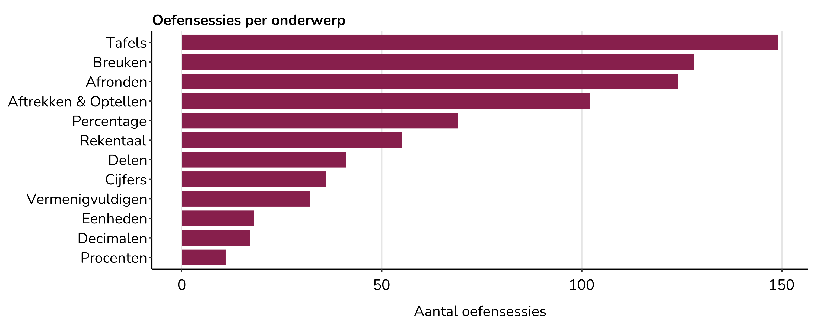
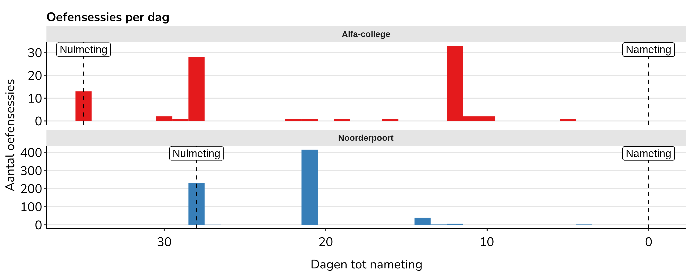
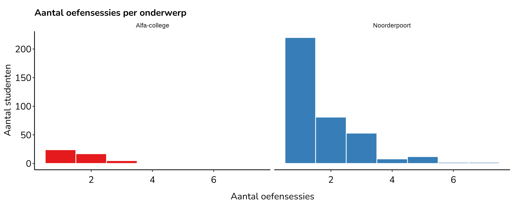
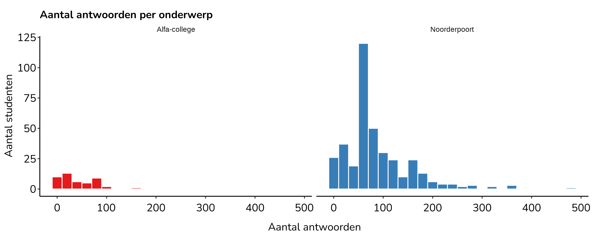
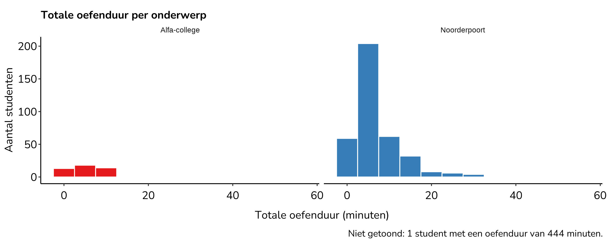
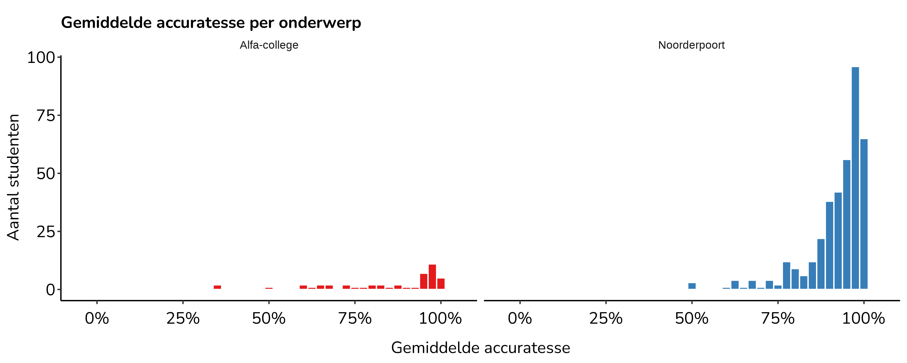

Practice activity
================
Maarten van der Velde
Last updated: 2025-03-14

- [Get practice data](#get-practice-data)
  - [Noorderpoort](#noorderpoort)
  - [Alfa-college](#alfa-college)
- [Activity statistics](#activity-statistics)
  - [Noorderpoort](#noorderpoort-1)
  - [Alfa-college](#alfa-college-1)
  - [Topics](#topics)
  - [Time](#time)
  - [Students](#students)

``` r
library(here)
library(data.table)
library(ggplot2)
library(jsonlite)
library(purrr)

theme_memorylab_url <- "https://raw.githubusercontent.com/SlimStampen/theme_memorylab/master/theme_memorylab.R"
source(theme_memorylab_url)

source(here("..", "databases", "database_functions.R"))

big_mark <- ","
fig_caption <- paste0("© 2025 MemoryLab")
```

# Get practice data

## Noorderpoort

``` r
np_name <- "noorderpoort.memorylab.app"
np_start_date <- "2024-10-07"
np_end_date <- "2024-11-04"
```

``` r
# Find the np ID for the specified domain
np_id <- query_db(paste0("SELECT id FROM domain WHERE name = '", np_name, "'"), database = "slimstampen")

# Get users registered to this domain (includes inactive users)
np_users <- query_db(paste0("SELECT id, create_time, last_practice_time FROM users WHERE domain_id = ", np_id, ";"), database = "slimstampen")

# Get lessons on this domain (includes deleted lessons)
np_lessons <- query_db(paste0("SELECT * FROM lesson WHERE domain_id = ", np_id, ";"), database = "slimstampen")

# Get sessions on this domain
np_sessions <- query_db(paste0("SELECT * FROM session WHERE token_id = 2 AND user_id IN (", paste(np_users$id, collapse = ", "), ") AND create_time >= '", np_start_date, "' AND create_time <= '", np_end_date, "';"), database = "ssaas")

# Get responses on this domain
np_responses <- query_db(paste0("SELECT * FROM response WHERE token_id = 2 AND session_id IN ('", paste(np_sessions$id, collapse = "', '"), "');"), database = "ssaas")

# Get facts on this domain
np_fact_ids <- unique(np_responses$fact_id)
np_facts <- query_db(paste0("SELECT * FROM fact WHERE token_id = 2 AND id IN (", paste(np_fact_ids, collapse = ", "), ");"), database = "ssaas")

# Get mastery credits on this domain
np_credits <- query_db(paste0("SELECT * FROM lesson_mastered WHERE user_id IN (", paste(np_users$id, collapse = ", "), ") AND create_date >= '", np_start_date, "' AND create_date <= '", np_end_date, "';"), database = "slimstampen")
```

``` r
# SESSIONS

# Clean session data
np_sessions <- np_sessions[, .(
  session_id = id,
  user_id,
  context,
  fact_ids,
  answer_method,
  create_time,
  algorithm_id,
  all_facts_mastered_time
)]

# Add lesson title
np_sessions[, lesson := map_chr(np_sessions$context, function (x) fromJSON(x)$title)]
# np_sessions[, context := NULL]

# Add date
np_sessions[, date := as.Date(create_time)]


# CREDITS
# Add lesson title
np_credits <- merge(np_credits, np_lessons[, .(lesson_id = id, lesson_title = title)], by = "lesson_id", all.x = TRUE)

# FACTS

# Parse encoded characters in fact text/answer and replace "+" with " "
parse_text <- function (text) {
  text <- URLdecode(text)
  gsub("+", " ", text, fixed = TRUE)
}

np_facts[, text := parse_text(text)]
np_facts[, answer := parse_text(answer)]
```

## Alfa-college

``` r
ac_name <- "alfa.memorylab.app"
ac_start_date <- "2024-11-06"
ac_end_date <- "2024-12-11"
```

``` r
# Find the domain ID for the specified domain
ac_id <- query_db(paste0("SELECT id FROM domain WHERE name = '", ac_name, "'"), database = "slimstampen")

# Get users registered to this domain (includes inactive users)
ac_users <- query_db(paste0("SELECT id, create_time, last_practice_time FROM users WHERE domain_id = ", ac_id, ";"), database = "slimstampen")

# Get lessons on this domain (includes deleted lessons)
ac_lessons <- query_db(paste0("SELECT * FROM lesson WHERE domain_id = ", ac_id, ";"), database = "slimstampen")

# Get sessions on this domain
ac_sessions <- query_db(paste0("SELECT * FROM session WHERE token_id = 2 AND user_id IN (", paste(ac_users$id, collapse = ", "), ") AND create_time >= '", ac_start_date, "' AND create_time <= '", ac_end_date, "';"), database = "ssaas")

# Get responses on this domain
ac_responses <- query_db(paste0("SELECT * FROM response WHERE token_id = 2 AND session_id IN ('", paste(ac_sessions$id, collapse = "', '"), "');"), database = "ssaas")

# Get facts on this domain
ac_fact_ids <- unique(ac_responses$fact_id)
ac_facts <- query_db(paste0("SELECT * FROM fact WHERE token_id = 2 AND id IN (", paste(ac_fact_ids, collapse = ", "), ");"), database = "ssaas")

# Get mastery credits on this domain
ac_credits <- query_db(paste0("SELECT * FROM lesson_mastered WHERE user_id IN (", paste(ac_users$id, collapse = ", "), ") AND create_date >= '", ac_start_date, "' AND create_date <= '", ac_end_date, "';"), database = "slimstampen")
```

``` r
# SESSIONS

# Clean session data
ac_sessions <- ac_sessions[, .(
  session_id = id,
  user_id,
  context,
  fact_ids,
  answer_method,
  create_time,
  algorithm_id,
  all_facts_mastered_time
)]

# Add lesson title
ac_sessions[, lesson := map_chr(ac_sessions$context, function (x) fromJSON(x)$title)]
# ac_sessions[, context := NULL]

# Add date
ac_sessions[, date := as.Date(create_time)]


# CREDITS
# Add lesson title
ac_credits <- merge(ac_credits, ac_lessons[, .(lesson_id = id, lesson_title = title)], by = "lesson_id", all.x = TRUE)

# FACTS

# Parse encoded characters in fact text/answer and replace "+" with " "
parse_text <- function (text) {
  text <- URLdecode(text)
  gsub("+", " ", text, fixed = TRUE)
}

ac_facts[, text := parse_text(text)]
ac_facts[, answer := parse_text(answer)]
```

# Activity statistics

## Noorderpoort

``` r
np_no_registered_users <- nrow(np_users)
np_no_active_users <- np_sessions[, uniqueN(user_id)]

np_no_created_lessons <- nrow(np_lessons)
np_no_current_lessons <- nrow(np_lessons[deleted == FALSE])

np_no_facts <- nrow(np_facts)

np_no_sessions <- nrow(np_sessions)

np_no_trials <- nrow(np_responses)

np_no_credits <- nrow(np_credits)


format_num <- function (n) {
  format(n, big.mark = big_mark)
}

paste0("There were ", format_num(np_no_active_users), " active users at Noorderpoort during this period. Together, they completed ", format_num(np_no_sessions), " practice sessions, recording a total of ", format_num(np_no_trials), " responses and achieving ", format_num(np_no_credits), " mastery credits.")
```

    ## [1] "There were 108 active users at Noorderpoort during this period. Together, they completed 696 practice sessions, recording a total of 32,883 responses and achieving 433 mastery credits."

## Alfa-college

``` r
ac_no_registered_users <- nrow(ac_users)
ac_no_active_users <- ac_sessions[, uniqueN(user_id)]

ac_no_created_lessons <- nrow(ac_lessons)
ac_no_current_lessons <- nrow(ac_lessons[deleted == FALSE])

ac_no_facts <- nrow(ac_facts)

ac_no_sessions <- nrow(ac_sessions)

ac_no_trials <- nrow(ac_responses)

ac_no_credits <- nrow(ac_credits)


format_num <- function (n) {
  format(n, big.mark = big_mark)
}

paste0("There were ", format_num(ac_no_active_users), " active users at Alfa-college during this period. Together, they completed ", format_num(ac_no_sessions), " practice sessions, recording a total of ", format_num(ac_no_trials), " responses and achieving ", format_num(ac_no_credits), " mastery credits.")
```

    ## [1] "There were 32 active users at Alfa-college during this period. Together, they completed 86 practice sessions, recording a total of 1,937 responses and achieving 21 mastery credits."

## Topics

How frequently was each topic practised? There are often multiple
lessons pertaining to the same topic. To simplify the visualisation of
the results, show the number of sessions per topic, rather than per
lesson.

``` r
np_sessions[, context_parsed := map(context, function (x) {
  x <- fromJSON(x)
  data.table(lesson_id = x$lessonId,
             lesson_group_id = x$lessonGroupId,
             title = x$title)
})]

np_sessions_parsed <- np_sessions[, rbindlist(context_parsed), by = .(session_id, user_id, create_time, date)]

np_lesson_groups <- data.table(
  lesson_group_id = c(
    29092,
    29087,
    29096,
    29089,
    29098,
    29086,
    29097,
    29095,
    29090,
    29088,
    29094,
    29091),
  topic = c(
    "Rekentaal",
    "Breuken",
    "Percentage",
    "Eenheden",
    "Delen",
    "Afronden",
    "Cijfers",
    "Vermenigvuldigen",
    "Aftrekken & Optellen",
    "Decimalen",
    "Tafels",
    "Rekentaal"
  )
)

# Set lesson topics to the right order
np_lesson_groups[, topic := factor(topic, levels = c("Delen",
                                                     "Percentage",
                                                     "Cijfers",
                                                     "Breuken",
                                                     "Tafels",
                                                     "Decimalen",
                                                     "Aftrekken & Optellen",
                                                     "Vermenigvuldigen",
                                                     "Afronden",
                                                     "Eenheden",
                                                     "Rekentaal"))]


np_lessons <- merge(np_lessons, np_lesson_groups, by = "lesson_group_id")
np_sessions_parsed <- merge(np_sessions_parsed, np_lesson_groups, by = "lesson_group_id")


ac_sessions[, context_parsed := map(context, function (x) {
  x <- fromJSON(x)
  data.table(lesson_id = x$lessonId,
             lesson_group_id = x$lessonGroupId,
             title = x$title)
})]

ac_sessions_parsed <- ac_sessions[, rbindlist(context_parsed), by = .(session_id, user_id, create_time, date)]

ac_lesson_groups <- data.table(
  lesson_group_id = c(
    29072,
    29073,
    29084,
    29079,
    29078,
    29074,
    29077,
    29082
  ),
  topic = c(
    "Breuken",
    "Decimalen",
    "Procenten",
    "Rekentaal",
    "Aftrekken & Optellen",
    "Delen",
    "Eenheden",
    "Vermenigvuldigen"
  )
)

ac_lessons <- merge(ac_lessons, ac_lesson_groups, by = "lesson_group_id")
ac_sessions_parsed <- merge(ac_sessions_parsed, ac_lesson_groups, by = "lesson_group_id")
```

``` r
np_topic_freq <- np_sessions_parsed[, .(school = "Noorderpoort", N = .N), by = topic]
ac_topic_freq <- ac_sessions_parsed[, .(school = "Alfa-college", N = .N), by = topic]
topic_freq <- rbind(np_topic_freq, ac_topic_freq)
topic_freq <- topic_freq[, .(N = sum(N)), by = topic]
```

``` r
ggplot(topic_freq, aes(x = reorder(topic, N), y = N)) +
  geom_bar(stat = "identity", width = 0.8, fill = colours_memorylab[1]) +
  coord_flip() +
  labs(title = "Oefensessies per onderwerp",
       x = NULL,
       y = "Aantal oefensessies",
       fill = NULL) +
  theme_ml() +
  theme(panel.grid.major.x = element_line(colour = "grey90"),
        legend.position = "bottom")
```

<!-- -->

``` r
ggsave(here("output", "memorylab_oefensessies_gecombineerd.png"), width = 10, height = 4)
```



## Time

When did students practice with MemoryLab?

``` r
session_dates <- rbind(
  np_sessions_parsed[, .(school = "Noorderpoort", session_id, date, days_until_posttest = as.numeric(as.Date(np_end_date) - date))],
  ac_sessions_parsed[, .(school = "Alfa-college", session_id, date, days_until_posttest = as.numeric(as.Date(ac_end_date) - date))]
)

np_start_days <- as.Date(np_end_date) - as.Date(np_start_date)
ac_start_days <- as.Date(ac_end_date) - as.Date(ac_start_date)

ggplot(session_dates, aes(x = days_until_posttest, fill = school)) +
  facet_wrap(~ school, ncol = 1, scales = "free_y") +
  geom_histogram(binwidth = 1) +
  geom_vline(data = data.table(school = c("Noorderpoort", "Alfa-college"),
                               start_days = c(np_start_days, ac_start_days)),
             aes(xintercept = start_days), linetype = "dashed") +
  geom_vline(xintercept = 0, linetype = "dashed") +
  geom_label(data = data.table(school = c("Noorderpoort", "Alfa-college"),
                               start_days = c(np_start_days, ac_start_days)),
             aes(x = start_days, y = Inf), label = "Nulmeting", vjust = 1.05, hjust = .5, fill = "white") +
  geom_label(data = NULL, x = 0, y = Inf, label = "Nameting", vjust = 1.05, hjust = .5, fill = "white") +
  labs(title = "Oefensessies per dag",
       x = "Dagen tot nameting",
       y = "Aantal oefensessies",
       fill = NULL) +
  scale_x_reverse() +
  scale_fill_brewer(palette = "Set1") +
  guides(fill = "none") +
  theme_ml() +
  theme(strip.text = element_text(face = "bold"),
        strip.background = element_rect(fill = "grey90"),
        panel.grid.major.y = element_line(colour = "grey90"))
```

<!-- -->

``` r
ggsave(here("output", "memorylab_oefensessies_per_dag.png"), width = 10, height = 4)
```



## Students

Calculate some activity statistics per student, per topic:

``` r
np_session_stats <- np_responses[, .(
  n_responses = .N,
  duration = max(presentation_start_time) + presentation_duration[which.max(presentation_start_time)] - min(presentation_start_time),
  accuracy = mean(correct)
), by = .(user_id, session_id)]

np_session_stats <- merge(np_session_stats, np_sessions_parsed[, .(session_id, topic)], by = "session_id")

np_practice_stats <- np_session_stats[, .(
  n_sessions = .N,
  n_responses = sum(n_responses),
  duration = sum(duration)/60000,
  accuracy = mean(accuracy),
  school = "Noorderpoort"
), by = .(user_id, topic)]

ac_session_stats <- ac_responses[, .(
  n_responses = .N,
  duration = max(presentation_start_time) + presentation_duration[which.max(presentation_start_time)] - min(presentation_start_time),
  accuracy = mean(correct)
), by = .(user_id, session_id)]

ac_session_stats <- merge(ac_session_stats, ac_sessions_parsed[, .(session_id, topic)], by = "session_id")

ac_practice_stats <- ac_session_stats[, .(
  n_sessions = .N,
  n_responses = sum(n_responses),
  duration = sum(duration)/60000,
  accuracy = mean(accuracy),
  school = "Alfa-college"
), by = .(user_id, topic)]

practice_stats <- rbind(np_practice_stats, ac_practice_stats)
```

Number of sessions *per topic*:

``` r
ggplot(practice_stats, aes(x = n_sessions, fill = school)) +
  facet_grid(~ school) +
  geom_histogram(binwidth = 1, colour = "white") +
  labs(title = "Aantal oefensessies per onderwerp",
       x = "Aantal oefensessies",
       y = "Aantal studenten",
       fill = NULL) +
  scale_fill_brewer(palette = "Set1") +
  guides(fill = "none") +
  theme_ml()
```

<!-- -->

``` r
ggsave(here("output", "memorylab_oefensessies_per_onderwerp.png"), width = 10, height = 4)
```



Number of responses *per topic*:

``` r
ggplot(practice_stats, aes(x = n_responses, fill = school)) +
  facet_grid(~ school) +
  geom_histogram(binwidth = 20, colour = "white") +
  labs(title = "Aantal antwoorden per onderwerp",
       x = "Aantal antwoorden",
       y = "Aantal studenten",
       fill = NULL) +
  scale_fill_brewer(palette = "Set1") +
  guides(fill = "none") +
  theme_ml()
```

<!-- -->

``` r
ggsave(here("output", "memorylab_antwoorden_per_onderwerp.png"), width = 10, height = 4)
```



Practice duration *per topic*:

``` r
ggplot(practice_stats[duration < 100], aes(x = duration, fill = school)) +
  facet_grid(~ school) +
  geom_histogram(binwidth = 5, colour = "white") +
  labs(title = "Totale oefenduur per onderwerp",
       x = "Totale oefenduur (minuten)",
       y = "Aantal studenten",
       fill = NULL,
       caption = "Niet getoond: 1 student met een oefenduur van 444 minuten.") +
  scale_fill_brewer(palette = "Set1") +
  guides(fill = "none") +
  theme_ml()
```

<!-- -->

``` r
ggsave(here("output", "memorylab_oefenduur_per_onderwerp.png"), width = 10, height = 4)
```



Accuracy *per topic*:

``` r
ggplot(practice_stats, aes(x = accuracy, fill = school)) +
  facet_grid(~ school) +
  geom_histogram(binwidth = 0.025, colour = "white") +
  labs(title = "Gemiddelde accuratesse per onderwerp",
       x = "Gemiddelde accuratesse",
       y = "Aantal studenten",
       fill = NULL) +
  scale_x_continuous(limits = c(-0.05, 1.05), labels = scales::percent_format()) +
  scale_fill_brewer(palette = "Set1") +
  guides(fill = "none") +
  theme_ml()
```

    ## Warning: Removed 4 rows containing missing values or values outside the scale
    ## range (`geom_bar()`).

<!-- -->

``` r
ggsave(here("output", "memorylab_accuratesse_per_onderwerp.png"), width = 10, height = 4)
```

    ## Warning: Removed 4 rows containing missing values or values outside the scale
    ## range (`geom_bar()`).



Save practice statistics for further analysis.

``` r
fwrite(practice_stats, here("data", "practice", "practice_stats.csv"))
```
