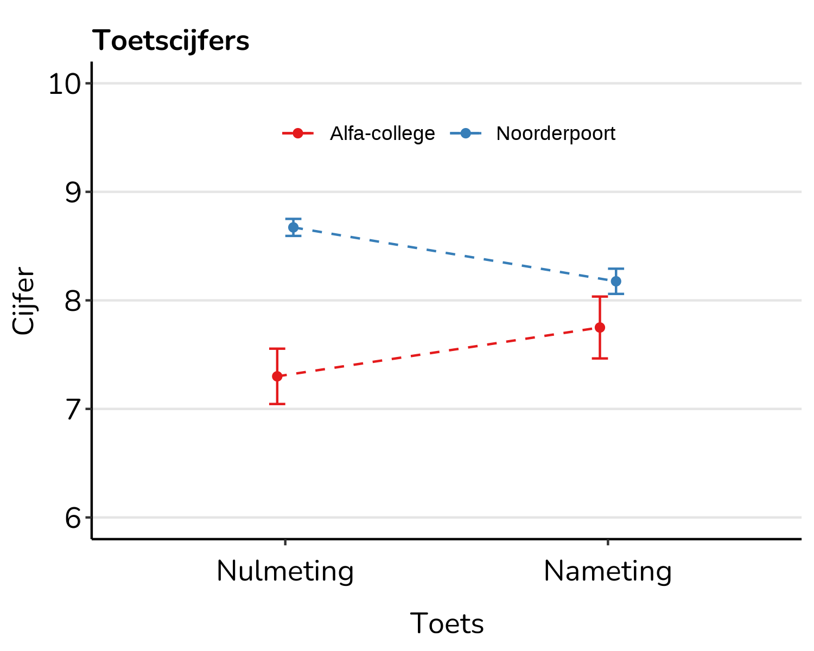
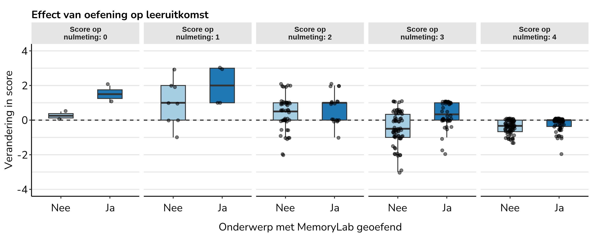
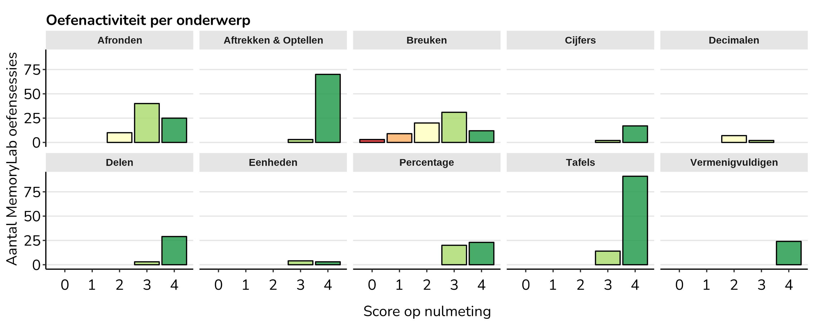
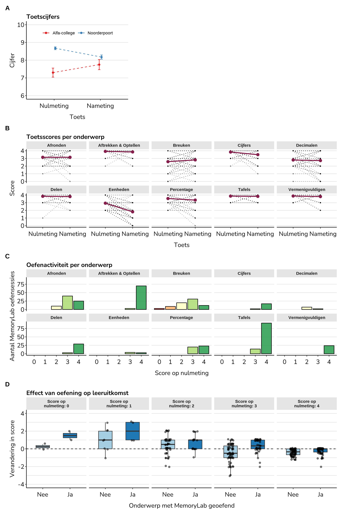

Test performance
================
Maarten van der Velde
Last updated: 2025-03-14

- [Get user data](#get-user-data)
- [Get test scores](#get-test-scores)
- [Mean scores](#mean-scores)
- [Relationship between practice and test
  scores](#relationship-between-practice-and-test-scores)
- [Did students practice what they found
  difficult?](#did-students-practice-what-they-found-difficult)
- [Combination plot](#combination-plot)

``` r
library(here)
library(data.table)
library(ggplot2)
library(jsonlite)
library(purrr)
library(lmerTest)
library(dplyr)
library(patchwork)

theme_memorylab_url <- "https://raw.githubusercontent.com/SlimStampen/theme_memorylab/master/theme_memorylab.R"
source(theme_memorylab_url)

source(here("..", "databases", "database_functions.R"))

big_mark <- ","
fig_caption <- paste0("© 2025 MemoryLab")
```

# Get user data

Practice statistics:

``` r
practice_stats <- fread(here("data", "practice", "practice_stats.csv"))
```

Get the email address associated with each MemoryLab user ID so that we
can link them to the test scores.

``` r
np_name <- "noorderpoort.memorylab.app"
np_id <- query_db(paste0("SELECT id FROM domain WHERE name = '", np_name, "'"), database = "slimstampen")
np_users <- query_db(paste0("SELECT id, email FROM users WHERE domain_id = ", np_id, ";"), database = "slimstampen")

ac_name <- "alfa.memorylab.app"
ac_id <- query_db(paste0("SELECT id FROM domain WHERE name = '", ac_name, "'"), database = "slimstampen")
ac_users <- query_db(paste0("SELECT id, email FROM users WHERE domain_id = ", ac_id, ";"), database = "slimstampen")
```

# Get test scores

``` r
np_test_scores <- fread(here("data", "test", "noorderpoort_scores_by_topic.csv"))
np_test_scores[, Email := tolower(trimws(Email))]

# Link to MemoryLab user IDs
np_test_scores <- merge(np_test_scores, np_users, by.x = "Email", by.y = "email", all = TRUE)

ac_test_scores <- fread(here("data", "test", "alfa_scores_by_topic.csv"))
ac_test_scores[, Email := tolower(trimws(Email))]

# Link to MemoryLab user IDs
ac_test_scores <- merge(ac_test_scores, ac_users, by.x = "Email", by.y = "email", all = TRUE)

# Combine
np_test_scores[, school := "Noorderpoort"]
ac_test_scores[, school := "Alfa-college"]
test_scores <- rbind(np_test_scores, ac_test_scores)
test_scores[, test := factor(test, levels = c("Pretest", "Posttest"), labels = c("Nulmeting", "Nameting"))]
```

For this analysis we’ll only include users of whom we have two test
scores as well as some MemoryLab practice data.

``` r
test_scores[, did_ml := !is.na(id)]
test_scores[, two_tests := uniqueN(test) == 2 && !any(is.na(score)), by = .(id)]
test_scores[, include_user := did_ml & two_tests]
```

How many complete cases do we have?

``` r
test_scores[include_user == TRUE, uniqueN(id), by = .(school)]
```

    ##          school    V1
    ##          <char> <int>
    ## 1: Noorderpoort    74
    ## 2: Alfa-college     5

# Mean scores

Mean test scores from included students:

``` r
test_scores_summary <-test_scores[include_user == TRUE & component == "Totaal punten"]
max_score <- 40
test_scores_summary[, grade := (score/max_score) * 10] # Convert to a grade on a scale of 0-10.

test_scores_mean <- test_scores_summary[, .(mean_grade = mean(grade), se_grade = sd(grade)/sqrt(.N), n = .N), by = .(school, test)]
test_scores_mean
```

    ##          school      test mean_grade   se_grade     n
    ##          <char>    <fctr>      <num>      <num> <int>
    ## 1: Noorderpoort Nulmeting   8.672297 0.07844366    74
    ## 2: Noorderpoort  Nameting   8.175676 0.11612114    74
    ## 3: Alfa-college Nulmeting   7.300000 0.25495098     5
    ## 4: Alfa-college  Nameting   7.750000 0.28504386     5

``` r
pos_dodge <- position_dodge(width = .1)

p_test_scores <- ggplot(test_scores_mean, aes(x = test, y = mean_grade, colour = school, group = school)) +
  geom_line(position = pos_dodge, lty = "dashed")  +
  geom_errorbar(aes(ymin = mean_grade - se_grade, ymax = mean_grade + se_grade), width = 0.1, position = pos_dodge) +
  geom_point(position = pos_dodge) +
  labs(title = "Toetscijfers",
       x = "Toets",
       y = "Cijfer",
       colour = NULL) +
  scale_y_continuous(limits = c(6, 10), breaks = seq(0, 10, 1)) +
  scale_colour_brewer(palette = "Set1") +
  theme_ml() +
  theme(legend.position = c(.5, .85),
        legend.direction = "horizontal",
        legend.background = element_blank(),
        panel.grid.major.y = element_line(colour = "grey90"))

p_test_scores
```

<!-- -->

``` r
ggsave(here("output", "test_scores.png"), width = 5, height = 4)
```



Is there a significant change in the grade between the tests?

``` r
# Noorderpoort
t.test(
  test_scores_summary[school == "Noorderpoort" & test == "Nulmeting", grade],
  test_scores_summary[school == "Noorderpoort" & test == "Nameting", grade],
  paired = TRUE
)
```

    ## 
    ##  Paired t-test
    ## 
    ## data:  test_scores_summary[school == "Noorderpoort" & test == "Nulmeting", grade] and test_scores_summary[school == "Noorderpoort" & test == "Nameting", grade]
    ## t = 5.2446, df = 73, p-value = 1.47e-06
    ## alternative hypothesis: true mean difference is not equal to 0
    ## 95 percent confidence interval:
    ##  0.3079023 0.6853410
    ## sample estimates:
    ## mean difference 
    ##       0.4966216

``` r
# Alfa-college
t.test(
  test_scores_summary[school == "Alfa-college" & test == "Nulmeting", grade],
  test_scores_summary[school == "Alfa-college" & test == "Nameting", grade],
  paired = TRUE
)
```

    ## 
    ##  Paired t-test
    ## 
    ## data:  test_scores_summary[school == "Alfa-college" & test == "Nulmeting", grade] and test_scores_summary[school == "Alfa-college" & test == "Nameting", grade]
    ## t = -1.327, df = 4, p-value = 0.2552
    ## alternative hypothesis: true mean difference is not equal to 0
    ## 95 percent confidence interval:
    ##  -1.3915383  0.4915383
    ## sample estimates:
    ## mean difference 
    ##           -0.45

# Relationship between practice and test scores

Get scores per topic and merge with practice statistics.

``` r
scores_by_topic_long <- test_scores[include_user == TRUE & !component %in% c("Totaal punten", "Cijfer"), .(
  user_id = id,
  topic = component,
  score,
  test
)]

scores_by_topic <- dcast(scores_by_topic_long, user_id + topic ~ test, value.var = "score")
scores_by_topic[, score_change := Nameting - Nulmeting]


scores_practice <- merge(scores_by_topic, practice_stats, by = c("user_id", "topic"), all.x = TRUE)
```

Scores by topic:

``` r
mean_scores <- scores_by_topic_long[, .(score = mean(score)), by = .(test, topic)]

mean_scores[order(test, score)]
```

    ##          test                topic    score
    ##        <fctr>               <char>    <num>
    ##  1: Nulmeting              Breuken 2.582278
    ##  2: Nulmeting            Decimalen 2.797468
    ##  3: Nulmeting             Eenheden 2.936709
    ##  4: Nulmeting             Afronden 3.151899
    ##  5: Nulmeting           Percentage 3.544304
    ##  6: Nulmeting                Delen 3.835443
    ##  7: Nulmeting              Cijfers 3.835443
    ##  8: Nulmeting               Tafels 3.860759
    ##  9: Nulmeting     Vermenigvuldigen 3.873418
    ## 10: Nulmeting Aftrekken & Optellen 3.924051
    ## 11:  Nameting             Eenheden 1.810127
    ## 12:  Nameting            Decimalen 2.721519
    ## 13:  Nameting              Breuken 2.810127
    ## 14:  Nameting             Afronden 3.151899
    ## 15:  Nameting           Percentage 3.341772
    ## 16:  Nameting              Cijfers 3.493671
    ## 17:  Nameting                Delen 3.797468
    ## 18:  Nameting     Vermenigvuldigen 3.797468
    ## 19:  Nameting               Tafels 3.822785
    ## 20:  Nameting Aftrekken & Optellen 3.848101
    ##          test                topic    score

``` r
p_scores_topic <- ggplot(scores_by_topic_long, aes(x = test, y = score)) +
  facet_wrap(~ topic, ncol = 5) +
  geom_point(alpha = .4, size = .5) +
  geom_line(aes(group = user_id), alpha = .4, lty = 3) +
  geom_point(data = mean_scores, colour = colours_memorylab[1], size = 2.5) +
  geom_line(data = mean_scores, aes(group = topic), colour = colours_memorylab[1], lwd = 1) +
  scale_x_discrete(labels = c("Nulmeting   ", "   Nameting")) +
  labs(x = "Toets", y = "Score", title = "Toetsscores per onderwerp") +
  theme_ml() +
  theme(strip.text = element_text(face = "bold"),
        strip.background = element_rect(fill = "grey90"),
        panel.grid.major.y = element_line(colour = "grey90"))

p_scores_topic
```

    ## Don't know how to automatically pick scale for object of type <integer64>.
    ## Defaulting to continuous.

<!-- -->

``` r
ggsave(here("output", "scores_topic.png"), width = 10, height = 4)
```

    ## Don't know how to automatically pick scale for object of type <integer64>.
    ## Defaulting to continuous.


Are any of these differences between the tests significant?

``` r
lmer(score ~ test*topic + (1|user_id), data = scores_by_topic_long) |>
  summary()
```

    ## Linear mixed model fit by REML. t-tests use Satterthwaite's method [
    ## lmerModLmerTest]
    ## Formula: score ~ test * topic + (1 | user_id)
    ##    Data: scores_by_topic_long
    ## 
    ## REML criterion at convergence: 3432.7
    ## 
    ## Scaled residuals: 
    ##     Min      1Q  Median      3Q     Max 
    ## -4.4025 -0.4559  0.1276  0.5859  3.3134 
    ## 
    ## Random effects:
    ##  Groups   Name        Variance Std.Dev.
    ##  user_id  (Intercept) 0.07023  0.2650  
    ##  Residual             0.46630  0.6829  
    ## Number of obs: 1580, groups:  user_id, 79
    ## 
    ## Fixed effects:
    ##                                          Estimate Std. Error         df t value
    ## (Intercept)                             3.152e+00  8.241e-02  1.177e+03  38.246
    ## testNameting                           -2.166e-15  1.087e-01  1.482e+03   0.000
    ## topicAftrekken & Optellen               7.722e-01  1.087e-01  1.482e+03   7.107
    ## topicBreuken                           -5.696e-01  1.087e-01  1.482e+03  -5.243
    ## topicCijfers                            6.835e-01  1.087e-01  1.482e+03   6.291
    ## topicDecimalen                         -3.544e-01  1.087e-01  1.482e+03  -3.262
    ## topicDelen                              6.835e-01  1.087e-01  1.482e+03   6.291
    ## topicEenheden                          -2.152e-01  1.087e-01  1.482e+03  -1.981
    ## topicPercentage                         3.924e-01  1.087e-01  1.482e+03   3.612
    ## topicTafels                             7.089e-01  1.087e-01  1.482e+03   6.524
    ## topicVermenigvuldigen                   7.215e-01  1.087e-01  1.482e+03   6.641
    ## testNameting:topicAftrekken & Optellen -7.595e-02  1.537e-01  1.482e+03  -0.494
    ## testNameting:topicBreuken               2.278e-01  1.537e-01  1.482e+03   1.483
    ## testNameting:topicCijfers              -3.418e-01  1.537e-01  1.482e+03  -2.224
    ## testNameting:topicDecimalen            -7.595e-02  1.537e-01  1.482e+03  -0.494
    ## testNameting:topicDelen                -3.797e-02  1.537e-01  1.482e+03  -0.247
    ## testNameting:topicEenheden             -1.127e+00  1.537e-01  1.482e+03  -7.332
    ## testNameting:topicPercentage           -2.025e-01  1.537e-01  1.482e+03  -1.318
    ## testNameting:topicTafels               -3.797e-02  1.537e-01  1.482e+03  -0.247
    ## testNameting:topicVermenigvuldigen     -7.595e-02  1.537e-01  1.482e+03  -0.494
    ##                                        Pr(>|t|)    
    ## (Intercept)                             < 2e-16 ***
    ## testNameting                           1.000000    
    ## topicAftrekken & Optellen              1.84e-12 ***
    ## topicBreuken                           1.81e-07 ***
    ## topicCijfers                           4.14e-10 ***
    ## topicDecimalen                         0.001131 ** 
    ## topicDelen                             4.14e-10 ***
    ## topicEenheden                          0.047825 *  
    ## topicPercentage                        0.000314 ***
    ## topicTafels                            9.36e-11 ***
    ## topicVermenigvuldigen                  4.37e-11 ***
    ## testNameting:topicAftrekken & Optellen 0.621179    
    ## testNameting:topicBreuken              0.138327    
    ## testNameting:topicCijfers              0.026280 *  
    ## testNameting:topicDecimalen            0.621179    
    ## testNameting:topicDelen                0.804833    
    ## testNameting:topicEenheden             3.72e-13 ***
    ## testNameting:topicPercentage           0.187677    
    ## testNameting:topicTafels               0.804833    
    ## testNameting:topicVermenigvuldigen     0.621179    
    ## ---
    ## Signif. codes:  0 '***' 0.001 '**' 0.01 '*' 0.05 '.' 0.1 ' ' 1

    ## 
    ## Correlation matrix not shown by default, as p = 20 > 12.
    ## Use print(x, correlation=TRUE)  or
    ##     vcov(x)        if you need it

Each student practiced only some of the topics, so per student we can
compare the score change on topics they practiced to topics they did not
practice.

``` r
scores_practice[, practiced := !is.na(duration)]

scores_by_practice_status <- scores_practice[, .(
  mean_score_change = mean(score_change, na.rm = TRUE),
  se_score_change = sd(score_change, na.rm = TRUE)/sqrt(.N),
  n = .N
), by = .(user_id, practiced, `Score op\nnulmeting` = Nulmeting)]


p_scores_by_practice <- ggplot(scores_by_practice_status, aes(x = practiced, y = mean_score_change, fill = practiced)) +
  facet_grid(~ `Score op\nnulmeting`, labeller = labeller(`Score op\nnulmeting` = label_both)) +
  geom_hline(yintercept = seq(-4, 4, 1), colour = "grey90") +
  geom_hline(yintercept = 0, linetype = "dashed") +
  geom_boxplot(width = .5, outlier.shape = NA) +
  geom_jitter(width = .1, height = .1, alpha = .5) +
  labs(x = "Onderwerp met MemoryLab geoefend",
       y = "Verandering in score",
       title = "Effect van oefening op leeruitkomst") +
  guides(fill = "none") +
  scale_fill_brewer(palette = "Paired") +
  scale_x_discrete(labels = c("Nee", "Ja")) +
  theme_ml() +
  theme(strip.text = element_text(face = "bold"),
        strip.background = element_rect(fill = "grey90"),
        panel.grid.major.y = element_line(colour = "grey90"))

p_scores_by_practice
```

<!-- -->

``` r
ggsave(here("output", "score_change_by_practice.png"), width = 10, height = 4)
```



Is this effect significant? Yes:

``` r
m_score_change <- lmer(score_change ~ practiced + practiced:z_nulmeting + (1|user_id), data = scores_practice |> mutate(z_nulmeting = scale(Nulmeting)))
summary(m_score_change)
```

    ## Linear mixed model fit by REML. t-tests use Satterthwaite's method [
    ## lmerModLmerTest]
    ## Formula: score_change ~ practiced + practiced:z_nulmeting + (1 | user_id)
    ##    Data: mutate(scores_practice, z_nulmeting = scale(Nulmeting))
    ## 
    ## REML criterion at convergence: 2031.9
    ## 
    ## Scaled residuals: 
    ##     Min      1Q  Median      3Q     Max 
    ## -3.9012 -0.5530  0.2584  0.5555  2.9940 
    ## 
    ## Random effects:
    ##  Groups   Name        Variance Std.Dev.
    ##  user_id  (Intercept) 0.03247  0.1802  
    ##  Residual             0.72667  0.8524  
    ## Number of obs: 790, groups:  user_id, 79
    ## 
    ## Fixed effects:
    ##                             Estimate Std. Error        df t value Pr(>|t|)    
    ## (Intercept)                 -0.29104    0.04271 131.48445  -6.815 3.08e-10 ***
    ## practicedTRUE                0.36175    0.06618 783.03416   5.466 6.19e-08 ***
    ## practicedFALSE:z_nulmeting  -0.26644    0.03711 785.54401  -7.181 1.61e-12 ***
    ## practicedTRUE:z_nulmeting   -0.41077    0.05653 782.55589  -7.266 8.97e-13 ***
    ## ---
    ## Signif. codes:  0 '***' 0.001 '**' 0.01 '*' 0.05 '.' 0.1 ' ' 1
    ## 
    ## Correlation of Fixed Effects:
    ##             (Intr) prTRUE pFALSE
    ## practcdTRUE -0.517              
    ## prctFALSE:_  0.045 -0.029       
    ## prctcTRUE:_ -0.005 -0.079  0.004

There is an overall positive effect of practice, and this effect is
stronger for topics where the initial score was lower.

# Did students practice what they found difficult?

Ideally, students would practice the topics on which they scored lowest
in the pretest.

``` r
prescores_practice <- scores_practice[, .(pre_score = mean(Nulmeting)), by = .(practiced, user_id)]
prescores_practice[, .(mean_pre_score = mean(pre_score)), by = .(practiced)]
```

    ##    practiced mean_pre_score
    ##       <lgcl>          <num>
    ## 1:     FALSE       3.373815
    ## 2:      TRUE       3.453075

``` r
lmer(pre_score ~ practiced + (1 | user_id), data = prescores_practice) |>
  summary()
```

    ## Linear mixed model fit by REML. t-tests use Satterthwaite's method [
    ## lmerModLmerTest]
    ## Formula: pre_score ~ practiced + (1 | user_id)
    ##    Data: prescores_practice
    ## 
    ## REML criterion at convergence: 249.4
    ## 
    ## Scaled residuals: 
    ##     Min      1Q  Median      3Q     Max 
    ## -6.0651 -0.2963  0.1097  0.5865  1.1950 
    ## 
    ## Random effects:
    ##  Groups   Name        Variance Std.Dev.
    ##  user_id  (Intercept) 0.03824  0.1955  
    ##  Residual             0.24663  0.4966  
    ## Number of obs: 155, groups:  user_id, 79
    ## 
    ## Fixed effects:
    ##                Estimate Std. Error        df t value Pr(>|t|)    
    ## (Intercept)     3.37381    0.06005 150.40855  56.184   <2e-16 ***
    ## practicedTRUE   0.07781    0.07990  77.95386   0.974    0.333    
    ## ---
    ## Signif. codes:  0 '***' 0.001 '**' 0.01 '*' 0.05 '.' 0.1 ' ' 1
    ## 
    ## Correlation of Fixed Effects:
    ##             (Intr)
    ## practcdTRUE -0.651

There was no significant difference in prescores however, between topics
that students did practice and topics that they did not.

Provided that students did practice a topic, did they spend more time on
topics with lower pretest scores? No:

``` r
lmer(n_responses ~ Nulmeting + (1 | user_id), data = scores_practice[practiced == TRUE]) |>
  summary()
```

    ## boundary (singular) fit: see help('isSingular')

    ## Linear mixed model fit by REML. t-tests use Satterthwaite's method [
    ## lmerModLmerTest]
    ## Formula: n_responses ~ Nulmeting + (1 | user_id)
    ##    Data: scores_practice[practiced == TRUE]
    ## 
    ## REML criterion at convergence: 2962
    ## 
    ## Scaled residuals: 
    ##     Min      1Q  Median      3Q     Max 
    ## -1.3735 -0.5119 -0.2870  0.3648  5.9576 
    ## 
    ## Random effects:
    ##  Groups   Name        Variance Std.Dev.
    ##  user_id  (Intercept)    0      0.00   
    ##  Residual             4377     66.16   
    ## Number of obs: 265, groups:  user_id, 76
    ## 
    ## Fixed effects:
    ##             Estimate Std. Error      df t value Pr(>|t|)   
    ## (Intercept)   57.333     19.294 263.000   2.971  0.00324 **
    ## Nulmeting      8.884      5.363 263.000   1.657  0.09880 . 
    ## ---
    ## Signif. codes:  0 '***' 0.001 '**' 0.01 '*' 0.05 '.' 0.1 ' ' 1
    ## 
    ## Correlation of Fixed Effects:
    ##           (Intr)
    ## Nulmeting -0.978
    ## optimizer (nloptwrap) convergence code: 0 (OK)
    ## boundary (singular) fit: see help('isSingular')

``` r
ggplot(scores_practice[practiced == TRUE], aes(x = as.factor(Nulmeting), y = n_responses)) +
  geom_boxplot(width = .5, outlier.shape = NA) +
  geom_jitter(width = .1, height = .1, alpha = .5) +
  labs(x = "Score op nulmeting",
       y = "Aantal gemaakte oefeningen") +
  scale_x_discrete() +
  theme_ml() +
  theme(panel.grid.major.y = element_line(colour = "grey90"))
```

<!-- -->

``` r
ggsave(here("output", "n_responses_by_score.png"), width = 10, height = 4)
```


Visualise the relation between pretest scores and practice activity per
topic.

``` r
p_practice <- scores_practice[practiced == TRUE, .(n_sessions_total = sum(n_sessions)), by = .(topic, Nulmeting)] |>
  ggplot(aes(x = Nulmeting, y = n_sessions_total)) +
  facet_wrap(~ topic, ncol = 5) +
  geom_col(aes(fill = as.factor(Nulmeting)), colour = "black", alpha = .8) +
  scale_fill_brewer(palette = "RdYlGn") +
  guides(fill = "none") +
  labs(x = "Score op nulmeting", y = "Aantal MemoryLab oefensessies", colour = "Onderwerp", title = "Oefenactiviteit per onderwerp") +
  theme_ml() +
  theme(panel.grid.major.y = element_line(colour = "grey90"),
        strip.text = element_text(face = "bold"),
        strip.background = element_rect(fill = "grey90"))

p_practice
```

<!-- -->

``` r
ggsave(here("output", "practice_activity.png"), width = 10, height = 4)
```



Total sessions by topic:

``` r
scores_practice[practiced == TRUE, .(n_sessions_total = sum(n_sessions)), by = .(topic)][order(-n_sessions_total)]
```

    ##                    topic n_sessions_total
    ##                   <char>            <int>
    ##  1:               Tafels              105
    ##  2:             Afronden               75
    ##  3:              Breuken               75
    ##  4: Aftrekken & Optellen               73
    ##  5:           Percentage               43
    ##  6:                Delen               32
    ##  7:     Vermenigvuldigen               24
    ##  8:              Cijfers               19
    ##  9:            Decimalen                9
    ## 10:             Eenheden                7

Total sessions by pretest score:

``` r
scores_practice[practiced == TRUE, .(n_sessions_total = sum(n_sessions)), by = .(Nulmeting)][order(-n_sessions_total)]
```

    ##    Nulmeting n_sessions_total
    ##        <num>            <int>
    ## 1:         4              294
    ## 2:         3              119
    ## 3:         2               37
    ## 4:         1                9
    ## 5:         0                3

# Combination plot

``` r
((p_test_scores + plot_spacer() + plot_layout(widths = c(1, 2)))  / p_scores_topic / p_practice / p_scores_by_practice) + plot_annotation(tag_levels =  "A", theme = theme_ml()) & theme(
    plot.tag = element_text(face = "bold")
  )
```

    ## Don't know how to automatically pick scale for object of type <integer64>.
    ## Defaulting to continuous.

<!-- -->

``` r
ggsave(here("output", "test_scores_and_practice.png"), width = 10, height = 15)
```

    ## Don't know how to automatically pick scale for object of type <integer64>.
    ## Defaulting to continuous.


